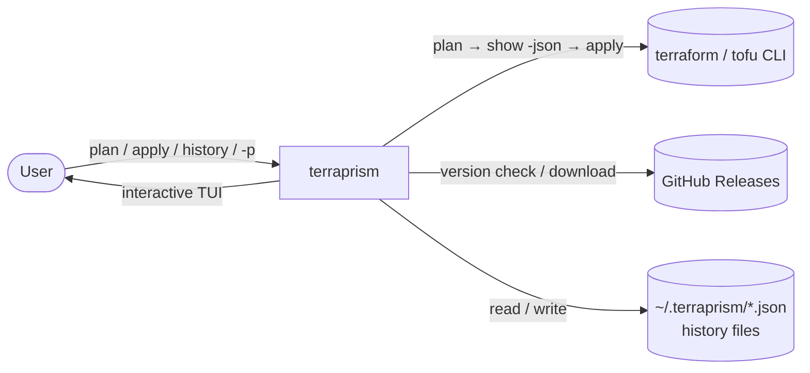
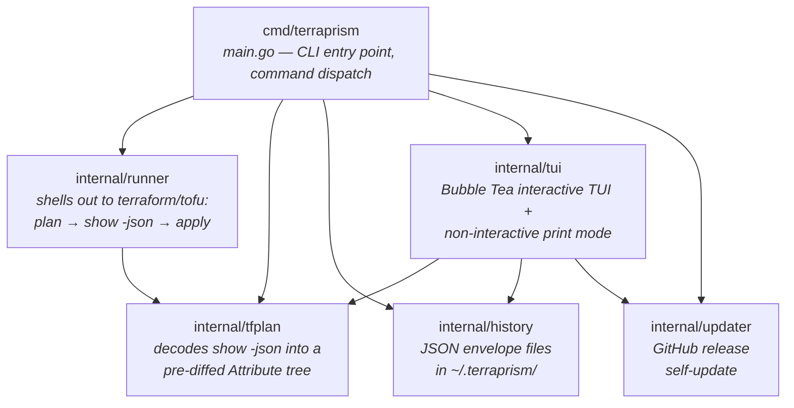
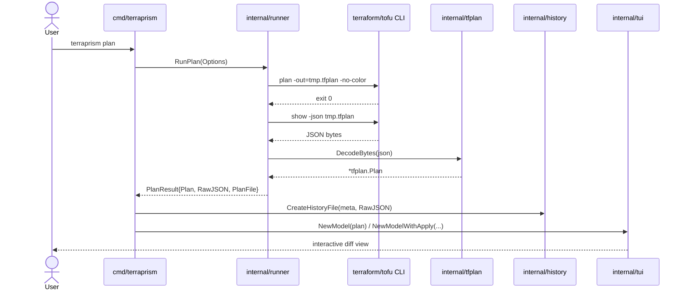
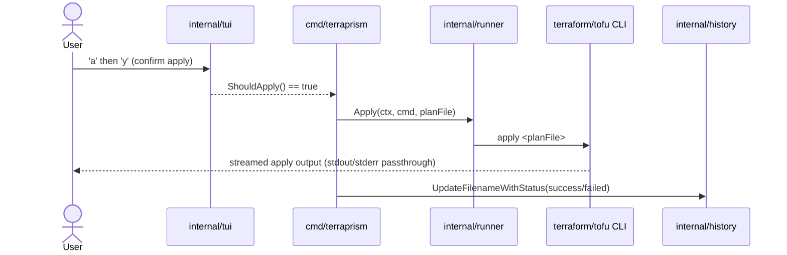
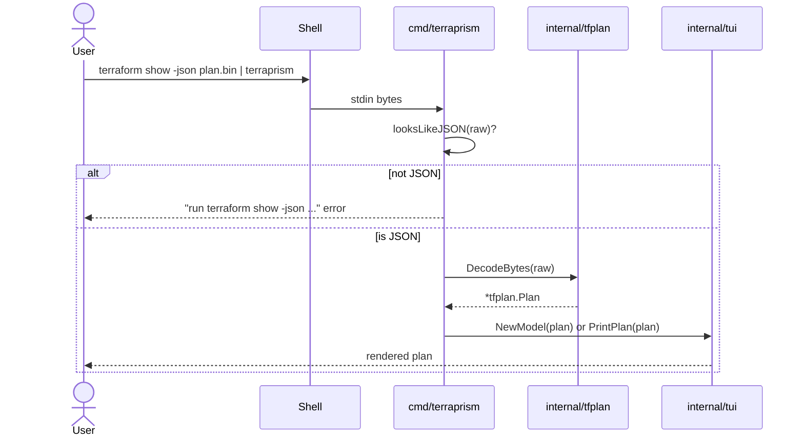
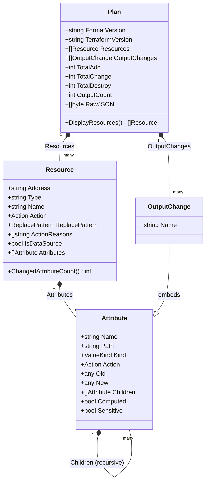
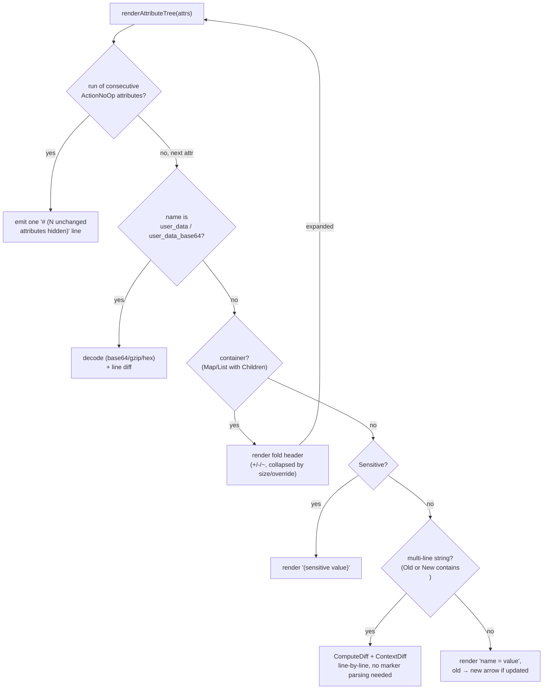

# Terraprism Architecture

This document describes how Terraprism is put together: its external
context, its internal packages and how they depend on each other, the
data model that flows between them, and the rendering pipeline that turns
a decoded plan into the interactive TUI.

For user-facing usage, see [README.md](README.md). For contributor
conventions, see [CLAUDE.md](CLAUDE.md).

## System Context

Terraprism is a CLI/TUI wrapper around `terraform`/`tofu`. It never talks
to cloud providers or Terraform state directly — it shells out to the
real `terraform`/`tofu` binary for everything infrastructure-related, and
its own job is limited to decoding that binary's JSON plan output into an
interactive view.

## Package Architecture

Each internal package has one job. Dependencies only point one direction
— `internal/tfplan` is a leaf package with no dependencies on anything
else in this repo, which keeps the decode logic testable and reusable
independent of the TUI or the runner.

| Package | Responsibility | Depends on |
|---|---|---|
| `cmd/terraprism` | Parses CLI args, dispatches to one of the run modes below, owns the "no changes" early exits | `history`, `runner`, `tfplan`, `tui`, `updater` |
| `internal/runner` | The **only** place that invokes the real `terraform`/`tofu` binary for plan/show/apply | `tfplan` |
| `internal/tfplan` | Decodes `terraform show -json` via `hashicorp/terraform-json`, builds the pre-diffed `Attribute` tree, exposes plan-wide summary counts | *(none — leaf package)* |
| `internal/history` | Persists/lists/renames plan & apply runs as JSON envelope files | *(none)* |
| `internal/tui` | Renders a `*tfplan.Plan` — either interactively (Bubble Tea `Model`) or flat (`PrintPlan`) | `tfplan`, `history` (picker only), `updater` (update nudge) |
| `internal/updater` | Checks GitHub Releases for newer versions and self-updates the binary | *(none)* |

## Command Dispatch

`main()` routes `os.Args` to one of several run modes. `plan`/`apply`/
`destroy` invoke the runner; bare/file input goes through the JSON-sniffing
view mode; anything not recognized as a Terraprism subcommand passes
straight through to `terraform`/`tofu`.

## Data Flow

### `terraprism plan` / `terraprism apply`

The runner always writes a binary plan file first (`show -json` requires
one — there's no way to get JSON plan output without it), then decodes
its JSON representation. The raw JSON bytes (not the parsed Go struct)
are what get persisted to history, so history stays re-decodable by any
future version of `tfplan.Decode`.

Confirming an apply inside the TUI hands control back to `main.go`, which
runs the apply against the plan file the runner already produced:

### Piped / file input (view mode)

Terraprism only accepts real `terraform show -json` output here — it
sniffs the first non-whitespace byte and fails with a corrective message
rather than trying to interpret plain plan text or a binary `-out=` file.

## Data Model

`tfplan.Decode` walks Terraform's JSON `before`/`after`/`after_unknown`/
`before_sensitive`/`after_sensitive` trees **once**, in parallel, and
produces a single pre-diffed `Attribute` tree per resource. This is the
core design choice of the whole rewrite: every downstream consumer
(interactive TUI, print mode) reads this tree directly and never
re-parses or re-diffs anything.

Notable properties of this model:

- **Attribute is recursive.** A leaf (`Kind` = string/number/bool/null)
  carries `Old`/`New`; a container (`Kind` = map/list) carries `Children`
  instead — each already diffed the same way. There is no separate
  "raw text" representation anywhere.
- **Existence, not nil-ness, drives `Action`.** A JSON `null` value and a
  genuinely absent key both decode to Go `nil`, so `Action` is derived
  from explicit `beforeExists`/`afterExists` booleans tracked through the
  recursive walk — otherwise an attribute explicitly set to `null` on a
  newly-created resource would be misclassified as unchanged instead of
  created.
- **Sensitivity and unknown-ness are per-node, not per-attribute.**
  Terraform's `before_sensitive`/`after_sensitive`/`after_unknown` are
  themselves value-shaped trees of booleans (e.g. `{"tags":{"Name":true}}`
  marks only `tags.Name` sensitive, not the whole map), so `Sensitive`/
  `Computed` are resolved at the same path-by-path granularity.
- **Outputs become synthetic resources for display.** `OutputChange`
  is a real, separate concept in the data model, but `Plan.DisplayResources()`
  flattens it into the same `[]Resource` shape (labeled `ActionOutput`)
  that the TUI already knows how to render, navigate, filter, and sort —
  so the rendering pipeline needs no separate code path for outputs.

## Rendering Pipeline

`internal/tui` walks the `Attribute` tree recursively
(`renderAttributeTree` for the interactive TUI, `printAttributeTree` for
flat print mode — both follow the same logic). Because Terraform's JSON
plan always carries the resource's *full* before/after state, most
attributes of a partially-changed resource are unchanged context rather
than part of the actual diff; those collapse into a single muted
`# (N unchanged attributes hidden)` note (matching Terraform CLI's own
convention) so the real change stays visible.

Fold/collapse state is keyed by `address + "#" + attribute.Path` (e.g.
`aws_instance.web#tags`) rather than by line offset, so it stays stable
across re-renders regardless of terminal width, diff-context setting, or
search/sort/filter state — the previous text-based renderer's fold keys
were line-offset-based and could drift.

## Key Design Decisions

1. **One JSON decode boundary, no regex.** `internal/tfplan` is the only
   place that interprets Terraform's plan format; nothing downstream
   re-parses text.
2. **The runner is the only thing that shells out.** `internal/runner`
   isolates every `terraform`/`tofu` invocation, making the plan→decode
   pipeline mockable in tests without a real Terraform binary.
3. **History persists raw JSON, not a parsed struct.** This keeps history
   files re-decodable by any future `tfplan.Decode` version and directly
   inspectable with `jq`.
4. **JSON-only input, with a corrective error.** Piping plain
   `terraform plan` text (instead of `terraform show -json` output) fails
   fast with an actionable message instead of misbehaving silently.
5. **Outputs are resources for display purposes.** `DisplayResources()`
   keeps `Resources`/`OutputChanges` as accurate, separate data while
   giving the TUI one unified, navigable list — and makes "plan has
   output-only changes" correctly count as "has changes."

## Testing Strategy

Terraprism's own tests never need real cloud infrastructure — it only
parses/renders plan JSON, it doesn't provision anything:

- `internal/tfplan/testdata/*.json` — hand-authored fixtures for specific
  edge cases (nested sensitivity paths, replace-pattern direction,
  zero-change plans) plus real fixtures captured once from `terraform`
  and `tofu` against no-network providers (`null_resource`, `random_id`),
  to catch schema drift between the hand-written fixtures and what the
  engines actually emit.
- `internal/runner` tests point `Options.Cmd` at a stand-in shell script
  instead of shimming `PATH`, since `Cmd` is just an executable path.
- `internal/history` tests redirect `$HOME` to a `t.TempDir()`.
