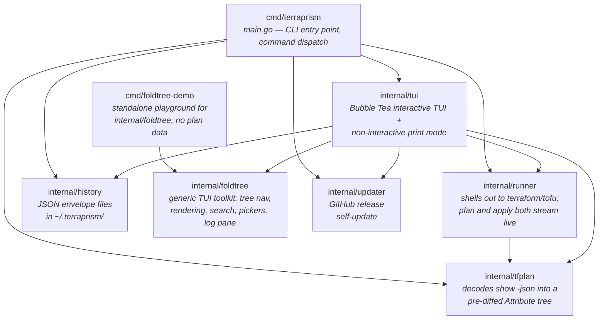
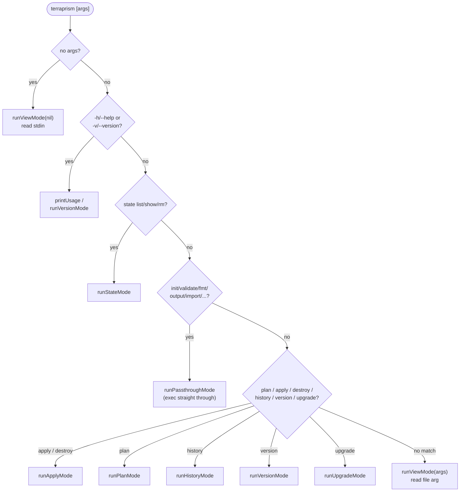
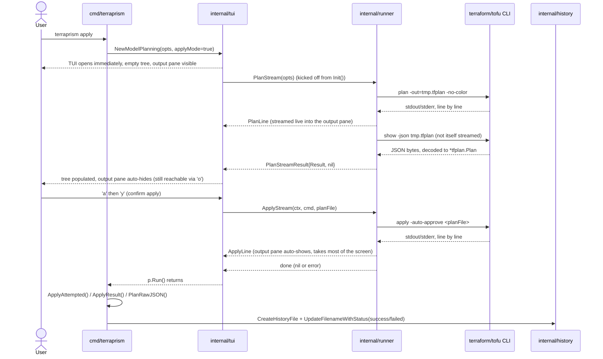
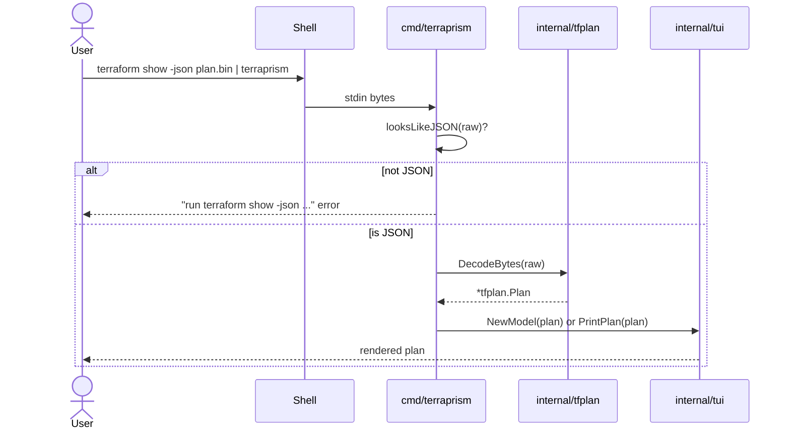
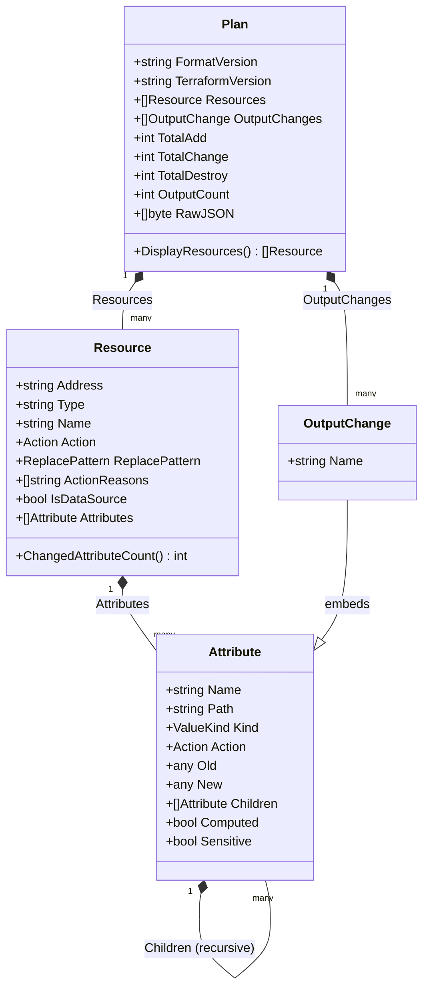
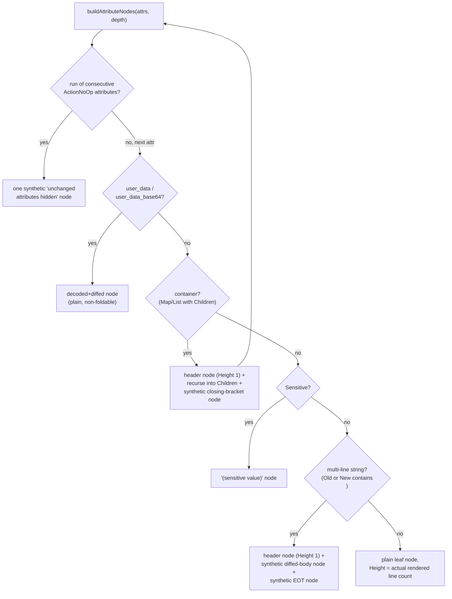

# Terraprism Architecture

This document describes how Terraprism is put together: its external
context, its internal packages and how they depend on each other, the
data model that flows between them, and the rendering pipeline that turns
a decoded plan into the interactive TUI.

For user-facing usage, see [README.md](README.md). For contributor
conventions, see [CLAUDE.md](CLAUDE.md).

## System Context

Terraprism is a CLI/TUI wrapper around `terraform`/`tofu`. It never talks
to cloud providers or Terraform state directly — it shells out to the
real `terraform`/`tofu` binary for everything infrastructure-related, and
its own job is limited to decoding that binary's JSON plan output into an
interactive view.

## Package Architecture

Each internal package has one job. Dependencies only point one direction
— `internal/tfplan` is a leaf package with no dependencies on anything
else in this repo, which keeps the decode logic testable and reusable
independent of the TUI or the runner.

| Package | Responsibility | Depends on |
|---|---|---|
| `cmd/terraprism` | Parses CLI args, dispatches to one of the run modes below, owns the "no changes" early exits and history bookkeeping | `history`, `runner`, `tfplan`, `tui`, `updater` |
| `cmd/foldtree-demo` | Interactive playground exercising `internal/foldtree` directly against synthetic sample trees, independent of any plan data — for trying navigation feel in isolation | `foldtree` |
| `internal/runner` | The **only** place that invokes the real `terraform`/`tofu` binary; `PlanStream`/`ApplyStream` stream output live over a channel instead of taking over the terminal, with `RunPlan` as a thin synchronous wrapper over `PlanStream` | `tfplan` |
| `internal/tfplan` | Decodes `terraform show -json` via `hashicorp/terraform-json`, builds the pre-diffed `Attribute` tree, exposes plan-wide summary counts | *(none — leaf package)* |
| `internal/history` | Persists/lists/renames plan & apply runs as JSON envelope files | *(none)* |
| `internal/tui` | Renders a `*tfplan.Plan` — either interactively (Bubble Tea `Model`) or flat (`PrintPlan`) — and, for `plan`/`apply`/`destroy`, drives `internal/runner`'s streaming functions itself from inside the running program | `tfplan`, `runner`, `history` (picker only), `updater` (update nudge), `foldtree` (navigation, rendering, search, pickers, log pane) |
| `internal/foldtree` | A generic, plan-agnostic TUI toolkit, not just navigation: `State` (cursor+scroll+collapse), `TreeView` (a full render+search `tea.Model` built on `State`), `Picker[T]` (a generic picker overlay), `LogPane` (an autoscrolling, searchable text pane), and `SplitView` (a primary+auxiliary pane compositor) | *(none — leaf package)* |
| `internal/updater` | Checks GitHub Releases for newer versions and self-updates the binary | *(none)* |

## File Tree

Every source file, one sentence each. Test files are grouped with the
file(s) they test where the mapping is obvious.

### `cmd/terraprism/`

- **`main.go`** — CLI entry point: parses `os.Args`, dispatches to a run mode (view/plan/apply/destroy/state/history/passthrough/version/upgrade), and owns history bookkeeping and the "no changes" exits.

### `cmd/foldtree-demo/`

- **`main.go`** — Demo entry point; picks between the bare-`State` navigation demo and the `--rich` `TreeView`/`Picker` demo at startup (Bubble Tea can't swap a running program's root model).
- **`samples.go`** — Sample tree builders (flat, nested, deep chain, wide fanout, multiline, deliberately faulty, large-with-blobs) for the bare-`State` demo.
- **`rich_model.go`** — The `--rich` demo's Bubble Tea model, wiring `foldtree.TreeView` and two `foldtree.Picker[string]` instances against synthetic data.
- **`rich_samples.go`** — Synthetic, non-Terraform "task board" sample data (titles + categories) used only by the `--rich` demo, to prove genericity by construction.

### `internal/foldtree/`

- **`foldtree.go`** — Core `Node`/`Row` types (including `Payload any`) and `Flatten`, the iterative tree-to-rows walk that respects collapse state.
- **`state.go`** — `State`, owning cursor position, scroll offset, and collapse state together so they can never drift apart.
- **`move.go`** — Cursor/scroll movement methods on `State` (`MoveUp`/`Down`, `PageUp`/`Down`, `MoveMouse`, `SelectIndex`, `ExpandSubtree`/`CollapseSubtree`, etc.).
- **`query.go`** — Read-only accessors on `State` (`SelectedID`, `Offset`, `Rows`, `VisibleRange`, `RowVisible`, etc.).
- **`search.go`** — `FuzzyMatch`, the exported fuzzy-matching predicate `TreeView`'s search is built on.
- **`picker.go`** — `Picker[T]`, a generic single/multi-select overlay widget (cursor, checkbox/marker rendering, select-all/clear-all).
- **`log_pane.go`** — `LogPane`, an append-only autoscrolling text pane with its own `g`/`G` navigation, `/`-search with match highlighting, toggleable word wrap (`w`, off by default, hard-wrapping unbreakable tokens so wrap and horizontal scroll are never both needed at once), and `h`/`l` horizontal scrolling.
- **`tree_view.go`** — `TreeView`, the full `tea.Model` combining `State` with rendering (via a caller-supplied `RowRenderer`) and search.
- **`split_view.go`** — `SplitView`, a generic primary+collapsible-auxiliary pane compositor with height allocation and focus-based key routing.
- **`styles.go`** — Minimal default lipgloss styles for foldtree's own chrome (selection highlight, muted text, search-match highlight) — callers rendering their own rows ignore these entirely.
- **`foldtree_test.go`** — Tests `Flatten`'s ordering, depth, collapse behavior, and `Payload` round-tripping.
- **`state_test.go`** — Tests `State`'s core cursor/scroll/collapse behavior and `SelectIndex`.
- **`move.go` / `query.go` behavior** is additionally covered by **`boundary_test.go`** (generalized regressions for real scroll/oscillation bugs found against production plans) and **`structure_test.go`** (adversarial shapes: negative heights, duplicate IDs, zero-height rows).
- **`coverage_test.go`** — Targets defensive branches the behavioral tests don't naturally reach but a real caller could still hit.
- **`fuzz_test.go`** — A randomized invariant fuzzer (many seeds × many random operation sequences) asserting the cursor is always in range and always visible after a move.
- **`helpers_test.go`** — Shared test-only tree builders (`leaf`, `block`, `flatRows`, `chainOf`, `countNodes`).
- **`picker_test.go`**, **`log_pane_test.go`**, **`tree_view_test.go`**, **`split_view_test.go`** — Behavioral tests for each of the four components above, each against synthetic data with no Terraform dependency.
- **`search_test.go`** — Tests `FuzzyMatch` directly.

### `internal/runner/`

- **`runner.go`** — Shells out to `terraform`/`tofu`: `RunPlan` (synchronous, wraps `PlanStream`), `PlanStream` (streams `plan` output then decodes via `show -json`), `ApplyStream` (streams `apply -auto-approve` output), and `DetectCommand`.
- **`runner_test.go`** — Drives all of the above against a stand-in shell script (`Options.Cmd` is just an executable path) instead of shimming `PATH`.

### `internal/tfplan/`

- **`doc.go`** — Package doc: what `tfplan` decodes and why there's no text/regex parsing involved.
- **`types.go`** — The data model: `Plan`, `Resource`, `Attribute`, `Action`, `ValueKind`, `ReplacePattern`.
- **`decode.go`** — `Decode`/`DecodeBytes`, unmarshaling `terraform show -json` via `hashicorp/terraform-json` and driving the recursive convert walk.
- **`convert.go`** — The recursive `before`/`after`/`after_unknown` walk that builds one pre-diffed `Attribute` tree per resource.
- **`sensitivity.go`** — Resolves `before_sensitive`/`after_sensitive`/`after_unknown` (themselves value-shaped boolean trees) down to per-attribute `Sensitive`/`Computed` flags.
- **`decode_test.go`** — Tests against hand-authored fixtures plus real `terraform`/`tofu` captures (`testdata/*.json`).

### `internal/history/`

- **`history.go`** — Persists/lists/renames plan & apply runs as JSON envelope files under `~/.terraprism/`.
- **`history_test.go`** — Tests against a `$HOME` redirected to `t.TempDir()`.

### `internal/updater/`

- **`updater.go`** — Checks GitHub Releases for newer versions (with a cache) and performs the self-update.
- **`updater_test.go`** — Tests the version-check/cache logic.

### `internal/tui/`

- **`doc.go`** — Package doc: what `tui` renders and how.
- **`model.go`** — The Bubble Tea `Model`: plan/apply streaming state machine, key dispatch, filter/sort/apply/output-pane orchestration, and the `RowRenderer`/`EmptyMessage` implementation handed to `foldtree.TreeView`.
- **`foldtree_adapter.go`** — Converts a `tfplan.Resource`'s `Attribute` tree into a `foldtree.Node` tree, with each node's `Payload` set to a `rowInfo` describing what to render.
- **`colorize.go`** — Per-kind attribute rendering helpers (action symbols, old→new value styling, key/value formatting).
- **`styles.go`** — Terraprism's own lipgloss palette and styles (distinct from `foldtree/styles.go`'s minimal chrome defaults).
- **`diff.go`** — Generic line-based context-diff engine (`ComputeDiff`/`ContextDiff`), with no Terraform dependency, used for multi-line string and userdata diffing.
- **`decode_userdata.go`** — Detects and decodes `user_data`/`user_data_base64`-shaped values (base64, gzip, hex) for readable diffing.
- **`print.go`** — Non-interactive flat renderer (`PrintPlan`) for `-p`/`--print` mode; walks `Attribute` directly, no cursor or fold state.
- **`picker.go`** — `PickerModel`, the plan/apply **history** picker (unrelated to `foldtree.Picker[T]` despite the similar name).
- **`state_model.go`** — `StateModel`, the separate `terraform state list/show/rm` browser TUI, with its own hand-rolled cursor/viewport (a known, explicitly out-of-scope duplicate of the pattern `foldtree` replaced elsewhere).
- **`model.go` behavior** is covered by **`model_render_test.go`** (attribute-tree rendering fidelity), **`scroll_test.go`** (mouse/keyboard scroll wiring), **`expand_bug_test.go`** (scoped vs. global expand/collapse), **`foldtree_adapter_test.go`** (node-height-matches-rendered-text, the core adapter invariant), **`output_pane_test.go`** (output-pane toggling, sizing, and key routing), **`apply_stream_test.go`** and **`plan_stream_test.go`** (end-to-end streaming through a real fake-`terraform` subprocess), and **`benchmark_test.go`** (rebuild/resize performance on a large synthetic plan).
- **`decode_userdata_test.go`**, **`styles_test.go`** — Tests for their same-named files.

## Command Dispatch

`main()` routes `os.Args` to one of several run modes. `plan`/`apply`/
`destroy` invoke the runner; bare/file input goes through the JSON-sniffing
view mode; anything not recognized as a Terraprism subcommand passes
straight through to `terraform`/`tofu`.

## Data Flow

### `terraprism plan` / `terraprism apply`

`main.go` no longer runs `plan` (or `apply`) itself — it builds the TUI up
front (`tui.NewModelPlanning`, with an empty plan and the output pane
already visible) and lets the **running program** drive
`internal/runner`'s streaming functions from its own `Init()`/`Update()`
loop, appending each line to the pane as it arrives. `main.go` only reads
the outcome back off the returned model once `p.Run()` exits. Quitting is
blocked for the whole duration of a plan or apply, so `main.go`'s
plan-file cleanup can never race a subprocess that's still running.

The binary plan file is always written first (`show -json` requires one —
there's no way to get JSON plan output without it). The raw JSON bytes
(not the parsed Go struct) are what get persisted to history, so history
stays re-decodable by any future version of `tfplan.Decode`.

### Piped / file input (view mode)

Terraprism only accepts real `terraform show -json` output here — it
sniffs the first non-whitespace byte and fails with a corrective message
rather than trying to interpret plain plan text or a binary `-out=` file.

## Data Model

`tfplan.Decode` walks Terraform's JSON `before`/`after`/`after_unknown`/
`before_sensitive`/`after_sensitive` trees **once**, in parallel, and
produces a single pre-diffed `Attribute` tree per resource. This is the
core design choice of the whole rewrite: every downstream consumer
(interactive TUI, print mode) reads this tree directly and never
re-parses or re-diffs anything.

Notable properties of this model:

- **Attribute is recursive.** A leaf (`Kind` = string/number/bool/null)
  carries `Old`/`New`; a container (`Kind` = map/list) carries `Children`
  instead — each already diffed the same way. There is no separate
  "raw text" representation anywhere.
- **Existence, not nil-ness, drives `Action`.** A JSON `null` value and a
  genuinely absent key both decode to Go `nil`, so `Action` is derived
  from explicit `beforeExists`/`afterExists` booleans tracked through the
  recursive walk — otherwise an attribute explicitly set to `null` on a
  newly-created resource would be misclassified as unchanged instead of
  created.
- **Sensitivity and unknown-ness are per-node, not per-attribute.**
  Terraform's `before_sensitive`/`after_sensitive`/`after_unknown` are
  themselves value-shaped trees of booleans (e.g. `{"tags":{"Name":true}}`
  marks only `tags.Name` sensitive, not the whole map), so `Sensitive`/
  `Computed` are resolved at the same path-by-path granularity. When a
  container's `after_unknown` is the bare bool `true` rather than a
  per-child map (its whole subtree is unknown, not just specific fields),
  every child inherits `Computed` from the parent rather than defaulting
  to "known" — there's no per-child entry to consult in that shape.
- **Unknown takes priority over "missing," not just "changed."**
  Terraform's plan JSON omits an attribute from `after` entirely when its
  value is wholly unknown — the same encoding it uses for a genuine
  deletion. An attribute that existed before and becomes unknown on
  update (e.g. a `helm_release`'s `metadata` block once any upstream
  input it depends on is itself unknown) would misread as deleted if
  existence were checked before the unknown flag; `diffAction`/
  `aggregateAction` check unknown first specifically for this
  `beforeExists && !afterExists` case, while still treating a truly
  absent-on-both-sides or newly-created attribute the same as before.
- **Outputs become synthetic resources for display.** `OutputChange`
  is a real, separate concept in the data model, but `Plan.DisplayResources()`
  flattens it into the same `[]Resource` shape (labeled `ActionOutput`)
  that the TUI already knows how to render, navigate, filter, and sort —
  so the rendering pipeline needs no separate code path for outputs.

## Rendering & Navigation Pipeline

Flat (`printAttributeTree`, print mode) rendering still walks the
`Attribute` tree recursively and is unaffected by anything below — it has
no cursor, no fold state, always fully expanded. The interactive TUI's
pipeline is a two-stage process: an **adapter** turns a resource's
`Attribute` tree into a generic, navigable tree once per structural
change, then `internal/foldtree` owns cursor/scroll state over that tree
independent of what it contains.

### 1. Adapter: `Attribute` tree → `foldtree.Node` tree

`buildResourceNode`/`buildAttributeNodes` (`internal/tui/foldtree_adapter.go`)
mirror the same branching print mode uses (no-op run collapsing, userdata
detection, container, sensitive, multi-line string, plain leaf), but
build `foldtree.Node`s instead of writing text. Every attribute — leaf or
foldable — becomes its own independently selectable node, not just
containers/multi-line strings as in earlier iterations of this renderer:

A node's `Height` is always derived by calling the real render function
(`renderLeafRow`, `renderMultilineStringBody`, …) and counting the
newlines it actually produces — never a parallel estimate — so scroll/
paging math can never silently drift from what's on screen. Containers
and multi-line strings declare `Height: 1` unconditionally (just their
own header/summary line); their expanded content exists only as
children, which `foldtree.Flatten` naturally omits while collapsed. Each
node's `Payload` is set directly to a `rowInfo` describing what that row
actually is (kind, the source `tfplan.Resource`/`Attribute`, pre-rendered
text) — `Flatten` copies `Payload` onto the corresponding `Row`
automatically, so there's no separate side-table to keep in sync with the
tree by hand.

### 2. `internal/foldtree.TreeView`: cursor + scroll + rendering + search, decoupled from the data

`foldtree.TreeView` wraps `State` (which flattens the `Node` tree into
`Rows()` — respecting current collapse state — and owns cursor position
and viewport scroll offset **together** in one place, so keyboard
navigation and mouse-wheel scrolling can never disagree about "where we
are": the root cause of several navigation bugs in earlier iterations of
this renderer, mouse-scroll/keyboard desync and boundary-scroll
oscillation) and adds the generic rendering loop and `/`-search on top,
as a self-contained `tea.Model`. None of it knows about Terraform, plan
data, or terraprism's own text rendering — `Model` supplies that via a
`RowRenderer` implementation (§3) — and `cmd/foldtree-demo` exercises the
whole stack standalone against synthetic trees for exactly this reason.

Most of `Model`'s former key handlers (the ones that used to juggle a
resource-index cursor and a separate fold-block cursor by hand) don't
exist anymore — `j`/`k`/`enter`/`e`/`c`/`E`/`C`/`g`/`G`/search/etc. are
simply forwarded to `treeView.Update(msg)`. `Model` only intercepts keys
that are genuinely terraprism-specific (`f`/`s`/`o`/`a`/`y`/`+`/`-`/`q`)
and reaches into `treeView.State()` directly only where a tui-specific
key needs raw tree-shape control (e.g. the `+`/`-` diff-context handlers,
which rebuild the tree and call `SetTree` again).

### 3. Rendering: `TreeView.render()` calls back into `Model`

`TreeView`'s internal `render()` walks `nav.Rows()` once and calls the
`RowRenderer` it was constructed with — `Model.RenderRow`/`EmptyMessage`
— for each row; `Model.RenderRow` dispatches by `rowInfo.kind` to the
same per-kind render helpers the old recursive walker used
(`renderFoldHeader`, `renderLeafRow`, `renderMultilineStringBody`, …).
`Model.RenderRow` is deliberately stateless (it reads `row.Collapsed` and
the `width`/`searchQuery` `TreeView` passes in, never a live `Model`
field) — that's what makes it safe to hand a `Model` snapshot to
`foldtree.NewTreeView` once, at construction, and never update it again.
`TreeView`'s own `viewport.YOffset` is set from `nav.Offset()` after
every mutation and never touched independently (mouse-wheel events are
translated to `nav.MoveMouse(delta)`, never forwarded to
`viewport.Update`).

Every node's ID is `address + "#" + attribute.Path` (e.g.
`aws_instance.web#tags`), with a deterministic suffix (`#close`, `#body`,
`#eot`, `#noop`) for the synthetic nodes a container/multi-line
string/no-op run adds — stable across rebuilds (resize, `diffContext`
change, filter/sort/search) regardless of terminal width or search state,
so `foldtree`'s ID-based selection-preservation keeps the right row
selected even if the tree structure around it changes.

## Key Design Decisions

1. **One JSON decode boundary, no regex.** `internal/tfplan` is the only
   place that interprets Terraform's plan format; nothing downstream
   re-parses text.
2. **The runner is the only thing that shells out.** `internal/runner`
   isolates every `terraform`/`tofu` invocation, making the plan→decode
   pipeline mockable in tests without a real Terraform binary.
3. **History persists raw JSON, not a parsed struct.** This keeps history
   files re-decodable by any future `tfplan.Decode` version and directly
   inspectable with `jq`.
4. **JSON-only input, with a corrective error.** Piping plain
   `terraform plan` text (instead of `terraform show -json` output) fails
   fast with an actionable message instead of misbehaving silently.
5. **Outputs are resources for display purposes.** `DisplayResources()`
   keeps `Resources`/`OutputChanges` as accurate, separate data while
   giving the TUI one unified, navigable list — and makes "plan has
   output-only changes" correctly count as "has changes."
6. **The whole interactive layer is a separate, generic toolkit, not
   TUI-specific state.** `internal/foldtree` knows nothing about
   Terraform — it started as just navigation (a tree of nodes, collapse
   state, cursor position, and scroll offset kept together in one
   `State`, replacing a two-cursor design that was the root cause of
   several navigation bugs) and grew into a full toolkit: rendering and
   search (`TreeView`), overlay pickers (`Picker[T]`), a searchable log
   pane (`LogPane`), and pane composition (`SplitView`). Being generic and
   decoupled means it's independently testable (adversarial structural
   tests, a randomized invariant fuzzer) and independently usable
   (`cmd/foldtree-demo`) without any plan data at all; `internal/tui`'s job
   is reduced to converting a `*tfplan.Plan` into the shapes this toolkit
   expects (a `foldtree.Node` tree via `foldtree_adapter.go`, a
   `RowRenderer` implementation) and supplying the handful of concerns
   that really are Terraform-specific (apply confirmation, the update
   nudge, `Action`/sort-order option lists).
7. **The TUI drives the runner itself; `main.go` doesn't run `plan` or
   `apply`.** For `plan`/`apply`/`destroy`, `main.go` constructs the TUI
   with `tui.NewModelPlanning` and lets the *running* program call
   `runner.PlanStream`/`ApplyStream` from its own `Init()`/`Update()` loop,
   streaming output into a hideable pane live instead of blocking the
   plain terminal beforehand (`plan`) or handing control back to a
   passthrough afterward (`apply`, previously). This is also why quitting
   is disabled for the duration of either: letting the TUI exit mid-run
   would race `main.go`'s plan-file cleanup against a still-running
   subprocess it no longer has any way to wait for.

## Testing Strategy

Terraprism's own tests never need real cloud infrastructure — it only
parses/renders plan JSON, it doesn't provision anything:

- `internal/tfplan/testdata/*.json` — hand-authored fixtures for specific
  edge cases (nested sensitivity paths, replace-pattern direction,
  zero-change plans, an attribute becoming wholly unknown on update)
  plus real fixtures captured once from `terraform` and `tofu` against
  no-network providers (`null_resource`, `random_id`), to catch schema
  drift between the hand-written fixtures and what the engines actually
  emit. Edge cases found against real production plans are reduced to
  the smallest fixture reproducing the same JSON shape rather than
  checking in the original (often large, and never something else's
  infrastructure data belongs in this repo).
- `internal/runner` tests point `Options.Cmd` at a stand-in shell script
  instead of shimming `PATH`, since `Cmd` is just an executable path.
- `internal/history` tests redirect `$HOME` to a `t.TempDir()`.
- `internal/foldtree` is tested entirely standalone, with synthetic data
  it constructs itself — no plan data, no Terraform dependency anywhere,
  even for the components (`TreeView`, `Picker[T]`, `LogPane`,
  `SplitView`) that do render and drive real Bubble Tea `tea.Model`
  cycles. Coverage includes ordinary navigation, adversarial structural
  cases (deep chains, wide fanout, zero/negative heights, duplicate IDs),
  a randomized invariant fuzzer (many seeds × many random operation
  sequences, asserting the cursor is always in range and always visible
  after a move), and regression tests for specific bugs found against a
  real-world plan (e.g. the boundary-scroll oscillation), generalized
  into synthetic shapes rather than depending on that plan's data.
- `internal/tui`'s `foldtree_adapter_test.go` checks the one property that
  matters most at the integration boundary: a node's declared `Height`
  always matches what its cached text actually renders as (including
  width-driven wrapping, not just diff-context-driven line counts) —
  the specific failure mode that would silently desync scroll position
  from the screen if the adapter and the renderer ever drifted apart.
- `internal/tui/apply_stream_test.go` and `plan_stream_test.go` drive the
  live-streaming control flow end to end against a real fake-`terraform`
  shell script (not a mock): confirming apply/plan actually starts a
  subprocess, streams its real stdout/stderr into the output pane line by
  line, and reaches the correct final state (including the failure path)
  — the same "no mocks for the thing that could actually drift" principle
  as `internal/runner`'s own tests.
